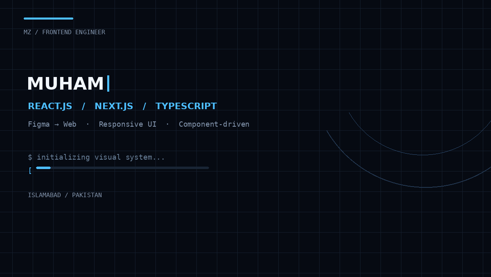
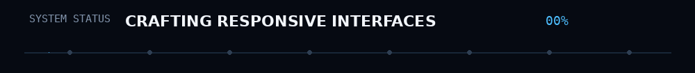

<div align="center">



<br>



<br><br>

<a href="https://github.com/dev-mzainulabideen">
  
</a>
<a href="https://www.linkedin.com/in/muhammad-zain-ul-abideen-4734823b1">
  
</a>
<a href="mailto:dev.mzainulabideen@gmail.com">
  
</a>

</div>

---

<h2 align="center">⚡ I turn designs into interfaces people enjoy using.</h2>

<p align="center">
Frontend-focused software developer · React.js · Next.js · TypeScript · Responsive UI · MERN
</p>

<p align="center">
<a href="#-about">About</a> ·
<a href="#-stack">Stack</a> ·
<a href="#-experience">Experience</a> ·
<a href="#-featured-work">Work</a> ·
<a href="#-activity">Activity</a> ·
<a href="#-education--recognition">Education</a> ·
<a href="#-connect">Connect</a>
</p>

---

## ✦ About

I'm a **Computer Science graduate from FAST-NUCES** and a frontend-focused developer who enjoys taking a design, requirement, or rough interface and turning it into a **clean, responsive, reusable product experience**.

My strongest area is **React-based frontend engineering**: Figma-to-web implementation, pixel-accurate UI, responsive/mobile-first layouts, reusable components, dashboards, forms, navigation, interactive states and animations.

Beyond the frontend, I have working experience with **MERN, REST APIs, authentication/authorization, React Native, Firebase and TensorFlow Lite** through professional, academic and industry-collaborative work.

> **Design precision + reusable engineering + responsive behavior.**

---

## 🧬 Stack

### Frontend
<p>


</p>

### Backend · Mobile · AI
<p>


</p>

### Languages · Engineering
<p>


</p>

<details>
<summary><b>Full engineering toolkit</b></summary>

<br>

`React Router DOM` · `React Navigation` · `Reanimated` · `AsyncStorage` · `ApexCharts` ·
`RESTful APIs` · `CRUD` · `JWT` · `OAuth 2.0` · `RBAC` · `MVC` · `Database Modeling` ·
`Authentication` · `Authorization` · `npm`

</details>

---

## 🚀 Experience

### `01` — Frontend Developer · Quecko Inc.
**May 2026 — Present · Islamabad, Pakistan**

> Building and refining responsive web interfaces in a structured software-development environment.

- React.js + JavaScript + SCSS + Bootstrap
- Reusable, maintainable components from design requirements
- Responsive desktop/tablet/mobile layouts
- Dashboards, forms, filters, modals, dropdowns, cards and navigation
- Git/GitHub collaboration and frontend issue resolution

### `02` — IT / Systems Intern · OGDCL
**11 March 2026 — 23 April 2026 · Islamabad, Pakistan**

- Supported enterprise IT operations and system troubleshooting
- Assisted with routine technical/system issues and maintenance
- Gained exposure to structured enterprise support workflows

### `03` — Software Developer · SignConnect Industry Collaboration
**2025 · Shaoor / SignConnect Final Year Project**

- React Native + TypeScript mobile interfaces for bidirectional sign-language translation
- Camera workflows + TensorFlow Lite on-device sign recognition
- Firebase Authentication, AsyncStorage, React Navigation and Reanimated
- Translation history, favourites and user statistics
- Industry-partner collaboration for requirements → functional features

### `04` — Lab Demonstrator — Artificial Intelligence · FAST-NUCES
**January 2024 — May 2024 · Islamabad, Pakistan**

- Weekly Python and AI laboratory sessions for **30+ students**
- Prepared examples, templates and implementation guidance
- Debugged programming/logical issues and mentored students

---

## 🧩 Featured Work

<table>
<tr>
<td width="50%" valign="top">

### 🖼️ NFT Marketplace
**React 19 · Vite · JavaScript · SCSS · Bootstrap 5**

Figma-based, pixel-accurate marketplace frontend with reusable marketplace, collection, auction and creator/collection interfaces.

`Responsive` `Filters` `Modals` `Carousels`

</td>
<td width="50%" valign="top">

### ⚡ Quecko Exchange
**React · Vite · JavaScript · SCSS**

Exchange-themed frontend with authentication-style flows, wallet interfaces, transaction history and P2P screens.

`OTP` `Wallet UI` `P2P` `Responsive`

</td>
</tr>
<tr>
<td width="50%" valign="top">

### 📊 Proft — Integrated Business Platform
**React · Vite · SCSS · Bootstrap · ApexCharts**

Product, pricing, workflow and dashboard interfaces with KPI cards, charts, forms and interactive states.

`Dashboards` `Charts` `Animations`

</td>
<td width="50%" valign="top">

### 🏠 RentEase
**React · Node · Express · MongoDB · JWT · OAuth 2.0**

Full-stack rental marketplace with **36+ pages**, **17+ REST endpoints**, **6 roles**, multi-layer verification, payments and admin workflows.

`RBAC` `REST API` `15+ Models`

</td>
</tr>
<tr>
<td width="50%" valign="top">

### 🤟 SignConnect
**React Native · TypeScript · Firebase · TensorFlow Lite**

Cross-platform assistive technology for ASL/PSL, text and voice. Documentation reports ~**85% recognition accuracy** and ~**15 ms inference time**.

`5 Modes` `Live Camera` `Auth`

</td>
<td width="50%" valign="top">

### 🏢 Hitech Sky Energy
**HTML5 · CSS3 · JavaScript · Bootstrap 5**

Responsive 4-page corporate platform with form validation, interactive behavior and Google Maps API integration.

`Responsive` `Maps API` `Bootstrap`

</td>
</tr>
</table>

<details>
<summary><b>More selected projects</b></summary>

<br>

| Project | Focus | Stack |
|---|---|---|
| **Proft — Business Website** | Responsive business website | React · Vite · SCSS · Bootstrap |
| **Rental Bazar** | Real-estate investment platform + dashboard | React · JavaScript |
| **Softlux Cleaning Website** | Service-business website | React · Vite · SCSS |
| **Coffee Shop Website** | Figma-based commerce UI | React · Vite · JavaScript · HTML5 · CSS3 |

</details>

---

## 🧠 Currently

```text
┌──────────────────────────────────────────────────────────────┐
│  BUILD      →  Responsive frontend experiences              │
│  FOCUS      →  React.js · reusable UI · responsive design   │
│  ENGINEER   →  Pixel-accurate Figma → Web implementation    │
│  GROW       →  Broader full-stack engineering via MERN      │
└──────────────────────────────────────────────────────────────┘
```

---

## 📈 Activity

<div align="center">

<a href="https://github.com/dev-mzainulabideen">

</a>
<a href="https://github.com/dev-mzainulabideen">

</a>

</div>

---

## 🎓 Education · Recognition

**BS Computer Science — FAST-NUCES**  
Islamabad, Pakistan · **Fall 2025**

Relevant coursework: Web Programming · Database Systems · Software Engineering · DSA · OOP · Cloud Computing · AI · Generative AI · UX Engineering · Technopreneurship · Market Management

<details>
<summary><b>Higher Secondary & Secondary Certificates</b></summary>

<br>

| Certificate | Institution | Year | Result |
|---|---|---|---|
| HSSC — Pre-Engineering | Army Public School & College, Sargodha Cantt. (FBISE) | 2020 | 945/1100 · 86% |
| SSC — Science | Army Public School & College, Sargodha Cantt. (FBISE) | 2018 | 1036/1100 · 94% |

</details>

### 📜 Certifications
- Responsive Web Design & JavaScript Algorithms — freeCodeCamp, 2024
- React.js — Udemy, 2025

### 🏆 FAST Startup Challenge 2024
- **3rd Position** — contributed to **SmartMeter360**, a proposed smart-home energy-management solution using smart sensors and a mobile app for consumption management, budgeting and energy-efficiency awareness.
- **Team Operations** — supported team coordination and operational execution throughout the competition.

**Leadership:** House Captain · Class Representative

---

## ✦ Strengths

`Frontend Engineering` · `Responsive Web Development` · `Figma-to-Web` · `Pixel Accuracy` ·
`Component Architecture` · `Problem Solving` · `Technical Troubleshooting` ·
`Attention to Detail` · `Team Collaboration` · `Technical Communication` · `Documentation`

---

## 🌐 Connect

<div align="center">

**Open to building useful interfaces, solving frontend problems, and growing through real software engineering work.**

<br>

<a href="https://github.com/dev-mzainulabideen">

</a>
<a href="https://www.linkedin.com/in/muhammad-zain-ul-abideen-4734823b1">

</a>
<a href="mailto:dev.mzainulabideen@gmail.com">

</a>

<br><br>

`Islamabad, Pakistan` · `English — Professional Working Proficiency` · `Urdu — Fluent`

</div>

---

<div align="center">

### `DESIGN → BUILD → REFACTOR → SHIP`

<sub>Frontend engineering · Responsive interfaces · Component-driven development</sub>

</div>
